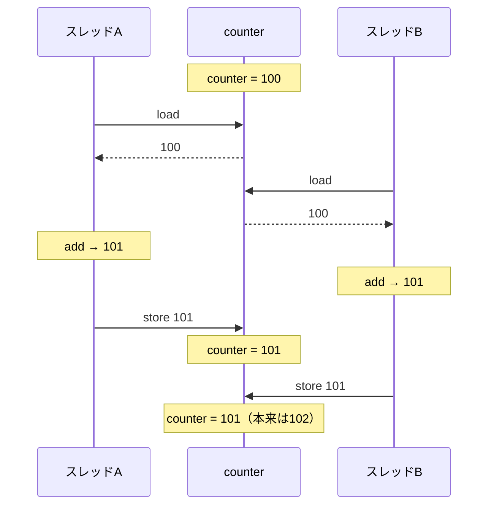

### CPUにおける変数更新の3ステップ

1. load
2. add
3. store

しかし、
2つのスレッドが同時に実行すると、加算が1回分消えることがある（counter = 100 のとき）。

```mermaid
sequenceDiagram
    participant A as スレッドA
    participant C as counter
    participant B as スレッドB

    Note over C: counter = 100
    A->>C: load
    C-->>A: 100
    B->>C: load
    C-->>B: 100
    Note over A: add → 101
    Note over B: add → 101
    A->>C: store 101
    Note over C: counter = 101
    B->>C: store 101
    Note over C: counter = 101（本来は102）
```
